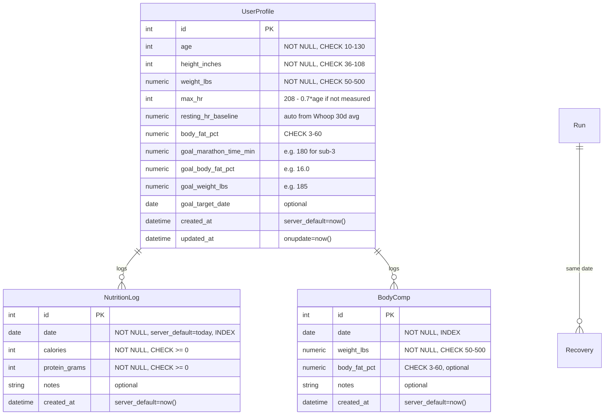

# Personal Performance Optimizer

## Enhancement Summary

**Deepened on:** 2026-03-08
**Agents used:** 10 (Python reviewer, Architecture strategist, Performance oracle, Security sentinel, Data integrity guardian, Best practices researcher, Framework docs researcher, Pattern recognition specialist, Code simplicity reviewer, Agent-native reviewer)

### Key Improvements from Deepening

1. **Use Flask Blueprints** — All 5 architecture agents agree: split app.py into `routes/` modules. Universal consensus.
2. **Kill TrainingPlan model + flatten Goals into UserProfile** — Simplicity reviewer: single user with 2 goals doesn't need a separate table. Remove 4 CRUD endpoints.
3. **DailyMetric: compute on-the-fly** — Performance oracle + simplicity reviewer: 924 runs is microseconds to compute. Cache in memory, not a DB table. Add a DailyMetric table later only if performance demands it.
4. **Split React SPA** — Architecture strategist: 815-line HTML will hit ~3000 lines. Split components into separate JS files loaded via script tags (no build step needed).
5. **Add service layer** — Python reviewer: route handlers shouldn't orchestrate TSS/CTL/VO2 computation. Add `src/services/coaching_service.py`.
6. **Fix require_auth for API routes** — Agent-native + security: return 401 JSON on `/api/*` instead of 302 redirect to HTML login.
7. **Enforce data constraints** — Data integrity: NOT NULL, check constraints, server defaults on all new columns. Use `Numeric` not `Float` for body comp.
8. **Structured briefing JSON** — Agent-native: add machine-readable workout fields alongside human-readable text.
9. **Keep Whoop out of briefing request path** — Performance oracle: briefing should read DB only. Background refresh handles Whoop.
10. **Defer photo upload entirely** — Security + simplicity: remove `photo_path` column until storage infrastructure decision is made.

### Simplifications (Cut List)

| Cut | Reason | Savings |
|-----|--------|---------|
| TrainingPlan model | Not used by stateless recommender | 1 model, 0 endpoints |
| Goal model (separate table) | Flatten into UserProfile fields | 1 model, 4 endpoints |
| DailyMetric table (for now) | Compute on-the-fly from runs | 1 model, migration |
| Photo upload (defer) | No storage infra, security risk | 1 endpoint, attack surface |
| **Total** | | **3 models, 5 endpoints cut** |

## Overview

Evolve Run Intel from a running activity tracker into a **personal performance optimizer** that prescribes daily workouts, tracks pace progression toward a sub-3 marathon, logs nutrition for body recomposition, estimates VO2 max for longevity, and answers the single most important question every morning: *"What should I do today to get faster, leaner, and live longer?"*

## Problem Statement

Run Intel currently records runs and shows recovery data, but it doesn't *coach*. The morning briefing says "you're primed" but never says "run 6 miles at 8:15 pace." It tracks 924 runs but can't answer "am I getting faster?" It has Whoop biometrics but doesn't connect them to body composition or longevity goals. The user wants:

1. **Daily prescribed workouts** adjusted for recovery — not just status labels
2. **Pace progression tracking** — "is my fitness improving toward sub-3?"
3. **Nutrition logging** — calories + protein to drive body recomposition
4. **Body composition tracking** — weight, body fat %, progress photos
5. **VO2 max & longevity metrics** — the #1 predictor of all-cause mortality
6. **Goal-aware coaching** — connecting all inputs into actionable daily guidance

### User Profile (Baseline)

| Metric | Current | Target |
|--------|---------|--------|
| Height | 6'1" | — |
| Weight | 200 lbs | ~185 lbs |
| Body Fat | ~22% | 16% |
| Marathon Goal | — | Sub-3:00 (6:51/mi) |
| VDOT | TBD from data | ~54 |
| VO2 Max | TBD | 50+ ml/kg/min (elite longevity) |

## Proposed Solution

Build five new capabilities on top of the existing Flask/PostgreSQL/Whoop stack, released incrementally so each phase delivers standalone value:

1. **Phase 1: Foundation** — New data models, daily metrics logging, goal setting
2. **Phase 2: Smart Coaching Engine** — Pace progression, Efficiency Factor, recovery-adjusted workout prescriptions
3. **Phase 3: Nutrition & Body Composition** — Calorie/protein logging, weight/BF% tracking, progress photos
4. **Phase 4: Longevity Dashboard** — VO2 max estimation, Zone 2 tracking, longevity score
5. **Phase 5: Morning Briefing 2.0** — Unified daily prescription combining all signals

## Prerequisites: Fix Before Building

Before starting Phase 1, resolve these existing bugs that will compound in the new features:

1. **todo #017 (P1):** `WhoopClient._request()` returns `None` on retry exhaustion — every new metric that depends on Whoop data will crash
2. **todo #028 (P2):** UTC vs local date inconsistency — new daily aggregations (TRIMP, nutrition compliance) will misattribute data near midnight
3. **todo #033 (P3):** Frontend API calls have no `.catch()` — new endpoints will fail silently

## Technical Approach

### Architecture

The existing stack stays: Flask + PostgreSQL + Whoop OAuth + React SPA. Key structural changes:

1. **Flask Blueprints** — Split routes from monolithic app.py into per-resource modules
2. **Service layer** — Coaching/metrics orchestration extracted from route handlers
3. **Frontend split** — React components in separate JS files (no build step)

```
src/
  app.py                    # Flask factory, middleware, auth — thin assembly
  config.py                 # Env var validation (existing)
  database.py               # SQLAlchemy models (existing + new)
  whoop.py                  # Whoop API client (existing)
  routes/
    __init__.py             # Register all blueprints
    briefing.py             # GET /api/briefing
    runs.py                 # GET/POST /api/runs, /api/trends, /api/snapshot, /api/shoes
    profile.py              # GET/PUT /api/profile
    nutrition.py            # CRUD /api/nutrition
    body_comp.py            # CRUD /api/body-comp
    metrics.py              # GET /api/metrics, /api/longevity
  services/
    __init__.py
    coaching.py             # EF, VDOT, TSS, VO2max computation (pure functions)
    metrics_service.py      # Orchestrates: fetch data → compute → return
    briefing_service.py     # Generates the full daily prescription
  static/
    index.html              # Shell: nav, layout, script tags
    js/
      app.js                # Shared state, API helpers, auth
      components/
        briefing.js         # Morning briefing 2.0
        run-log.js          # Run logger + coaching insight
        nutrition.js        # Nutrition logger
        body-comp.js        # Body comp tracker
        pace-progress.js    # EF/VDOT trend charts
        longevity.js        # VO2 max + Zone 2 dashboard
        settings.js         # User profile / goals
```

### Research Insight: Why Blueprints Now

All 5 architecture agents independently recommended this. The current `app.py` is 570 lines with 8 routes. Adding 12+ new endpoints would push it past 1000 lines with unrelated concerns (nutrition CRUD next to Whoop OAuth next to coaching algorithms). Blueprints are zero-dependency, built into Flask, and let each resource module be <100 lines. Apply `require_auth` via `@bp.before_request` instead of decorating every route.

### Research Insight: Service Layer

Route handlers should validate input, call a service, and return JSON. They should NOT orchestrate multi-step computations (fetch profile → query 42 days of runs → compute TSS → compute CTL/ATL → upsert metrics). That orchestration goes in `services/metrics_service.py`, making it independently testable without Flask or a database.

### Database Schema (New Models)



### Research Insight: Schema Simplifications

**Goal table eliminated.** A single user with 2 goals (marathon time, body fat %) doesn't need a polymorphic goal table with full CRUD. Goals are fields on UserProfile: `goal_marathon_time_min`, `goal_body_fat_pct`, `goal_weight_lbs`, `goal_target_date`. Updated via `PUT /api/profile`. Saves 4 API endpoints.

**TrainingPlan table eliminated.** The plan uses a stateless daily recommender, not a periodized plan engine. The TrainingPlan model would be dead code. Add it later if/when periodization is implemented.

**DailyMetric table eliminated (for now).** EF, VDOT, TSS, CTL, ATL, TSB are all computable on-the-fly from the runs table. 924 rows in a 42-day window = ~60 rows per computation = microseconds. Compute in `services/metrics_service.py` and return directly. No pre-computation needed for a single user. Add caching only if performance demands it.

### Research Insight: Data Integrity (from Data Integrity Guardian)

- **Use `Numeric` not `Float`** for weight, body fat, pace values. Float introduces IEEE 754 rounding (e.g., 196.4 stored as 196.39999999). Numeric stores exact decimal values.
- **Add CHECK constraints** on all new columns (age 10-130, weight 50-500, body_fat 3-60, calories >= 0).
- **Add `NOT NULL`** on required fields. A NutritionLog without calories is meaningless.
- **Add `server_default`** for timestamps and dates.
- **Consider Alembic** for migrations instead of `create_all`. As schema evolves, `create_all` cannot add columns to existing tables.

### Implementation Phases

#### Phase 0: Bug Fixes (Prerequisite)

Fix the three pre-existing bugs listed above. Small effort, high leverage — prevents cascading failures in all new features.

**Effort:** Small

---

#### Phase 1: Foundation (User Profile + Data Models + Onboarding + Blueprints)

Restructure Flask app into Blueprints, add new models, user profile/settings page, and API endpoints for nutrition and body composition. **The user profile is the critical unblock** — without age, max HR, and goals, no personalized feature can function.

**Step 1a: Restructure into Blueprints (before adding any features)**

Extract existing routes from `app.py` into `routes/` modules. This is a refactor-only step with no new features. Ensures the app can absorb 8+ new endpoints without becoming a monolith.

**Step 1b: Onboarding Flow**

1. User opens app after update → sees a "Set Up Your Profile" banner at the top
2. Settings page collects: age, height, weight, max HR (or auto-estimate), body fat %, goal race time, goal body fat %
3. All fields optional — features that need missing fields show "Complete your profile to unlock this"
4. Resting HR baseline auto-computed from Whoop recovery history (30-day average)
5. On save, trigger backfill of EF and zone distribution for all 924 historical runs (instant value)

**Step 1c: Fix `require_auth` for API routes**

Currently returns 302 redirect to HTML login page. For `/api/*` routes, return `401 {"error": "Unauthorized"}` instead. This unblocks agent/programmatic access.

**Files to create/modify:**

- `src/app.py` — Slim down to Flask factory + blueprint registration + middleware
- `src/routes/` — NEW: Blueprint modules for each resource
- `src/database.py` — Add UserProfile, NutritionLog, BodyComp models with constraints
- `src/static/js/components/settings.js` — NEW: Settings/profile component
- `src/static/js/components/nutrition.js` — NEW: Nutrition logger component
- `src/static/js/components/body-comp.js` — NEW: Body comp tracker component

**API Endpoints (8 endpoints — down from 14 in original plan):**

```
GET    /api/profile         — Get user profile (goals included as fields)
PUT    /api/profile         — Update user profile (upsert, single user)
POST   /api/nutrition       — Log calories + protein (optional date param, defaults to today)
GET    /api/nutrition        — Get nutrition logs (last 30 days, supports ?date=YYYY-MM-DD filter)
PUT    /api/nutrition/:id    — Edit a nutrition entry
DELETE /api/nutrition/:id    — Delete a nutrition entry
POST   /api/body-comp       — Log weight + body fat %
GET    /api/body-comp        — Get body comp history
```

**Key Design Decisions:**

- Goals are fields on UserProfile, not a separate table. `PUT /api/profile` updates goals. Saves 4 endpoints.
- All logging endpoints accept optional `date` param (defaults to today UTC). Allows backdating up to 7 days. No future dates.
- Edit and delete supported for nutrition and body comp. Users will make typos.
- Photos deferred entirely — no `photo_path` column. Add later with proper storage infra.
- `Numeric` type for weight, body fat, pace values (not Float). Exact decimal storage.
- CHECK constraints on all new columns. NOT NULL on required fields.

**Acceptance Criteria:**
- [x] Flask Blueprints: routes extracted from app.py into routes/ modules
- [x] require_auth returns 401 JSON for /api/* routes (not 302 redirect)
- [x] UserProfile model with age, height, weight, max HR, goal fields, CHECK constraints
- [x] Settings page in frontend to create/edit profile
- [x] Nutrition logging: calories + protein_grams with optional date, NOT NULL, CHECK >= 0
- [x] Body comp logging: weight + optional body_fat_pct with date
- [x] Edit and delete for nutrition and body comp entries
- [x] All new endpoints have input validation
- [x] Features gracefully show "set up profile" prompt when data is missing

**Effort:** Medium

---

#### Phase 2: Smart Coaching Engine

The core intelligence — compute fitness metrics from existing run data and prescribe workouts.

**Training Plan Approach:** Start with a **stateless daily recommender** (not a full periodized plan engine). The recommender uses recovery + ACWR + training history + VDOT to suggest today's workout type and distance. No multi-week plan structure in v1 — that's future work. This is achievable and already more valuable than the current generic briefing.

**Key Metrics to Compute:**

| Metric | Formula | Purpose |
|--------|---------|---------|
| Efficiency Factor (EF) | 1 / (pace_sec_per_mi / avg_hr) | Primary fitness indicator. Higher = fitter |
| VDOT | Daniels tables from recent race/time-trial | Maps to training paces |
| TSS (Training Stress Score) | duration_min * (avg_hr / threshold_hr)^2 | Daily training load |
| CTL (Chronic Training Load) | 42-day exponential moving average of TSS | Fitness |
| ATL (Acute Training Load) | 7-day exponential moving average of TSS | Fatigue |
| TSB (Training Stress Balance) | CTL - ATL | Form (positive = fresh) |
| ACWR | ATL / CTL | Injury risk (keep 0.8-1.3) |
| Est. VO2 Max | 15.3 * (max_hr / resting_hr) or pace-based | Longevity metric |
| Zone 2 Minutes | Sum of zone_one_milli + zone_two_milli from Whoop | Aerobic base |

**Files to create/modify:**

- `src/services/coaching.py` — NEW: Pure computation functions (no DB access)
  - `compute_efficiency_factor(pace_sec, avg_hr) -> float`
  - `estimate_vdot(distance_mi, time_min) -> float`
  - `compute_tss(duration_min, avg_hr, threshold_hr) -> float`
  - `compute_training_load(tss_history: list[float]) -> tuple[float, float, float]`  # CTL, ATL, TSB
  - `compute_acwr(atl, ctl) -> float`
  - `estimate_vo2max(resting_hr, max_hr, best_pace, age) -> float`
  - `prescribe_workout(recovery_score, hrv_pct, tsb, acwr, goal_pace) -> WorkoutRx`
  - `compute_zone2_minutes(zone_data: dict) -> int`
- `src/services/metrics_service.py` — NEW: Orchestration layer (fetches data, calls coaching, returns results)
  - `get_current_metrics(session, profile) -> MetricsSnapshot`  # EF, VDOT, CTL, ATL, TSB, ACWR, VO2max
  - `get_pace_progression(session, days=90) -> PaceProgression`
- `src/routes/metrics.py` — NEW: GET /api/metrics, GET /api/longevity
- `src/routes/briefing.py` — Update to use briefing_service

**Workout Prescription Logic:**

```python
def prescribe_workout(recovery, hrv_baseline_pct, tsb, acwr, phase, goal_pace):
    """
    Returns: { type, distance_mi, target_pace, description, rationale }

    Decision tree:
    1. If recovery < 33% OR acwr > 1.5 → REST or very easy 3mi
    2. If recovery < 50% OR tsb < -20 → Easy run, no pace pressure
    3. If recovery > 66% AND it's a hard day in plan → Tempo or intervals
    4. Otherwise → Easy run at conversational pace

    Pace targets from VDOT:
    - Easy: VDOT pace + 60-90 sec/mi
    - Tempo: VDOT pace + 15-25 sec/mi
    - Interval: VDOT pace - 10-20 sec/mi
    - Long run: VDOT pace + 45-75 sec/mi
    """
```

**Pace Progression Answer:**

The app will compute a rolling 30-day EF (Efficiency Factor) and compare to 90-day EF. If 30-day EF > 90-day EF, you're getting faster. Display as:

> "Your aerobic efficiency improved 4.2% this month. At this rate, you'll hit sub-3 marathon fitness by [date]. Current VDOT: 48 → Target: 54."

**Research Insight: Compute On-The-Fly, Not Stored**

The Performance Oracle confirmed: computing CTL (42-day EMA) requires scanning ~60 rows from the runs table. An indexed range scan on 60 rows is <1ms in PostgreSQL. The EMA computation is O(n) on ~60 floats — microseconds in Python. There is no performance reason to pre-compute or store daily metrics for a single user. Compute in the service layer and return directly.

The actual performance bottleneck is the Whoop API call in the briefing path. Keep Whoop fetches out of the critical path — read only from DB cache. The existing background refresh (commit `8b06a48`) already partially handles this.

**Research Insight: Type Safety for Coaching Returns**

Use Python dataclasses for structured returns from coaching functions:

```python
@dataclass
class WorkoutRx:
    type: str          # "easy" | "tempo" | "intervals" | "long" | "rest"
    distance_miles: float
    pace_min: str      # "8:10"
    pace_max: str      # "8:30"
    hr_cap: int | None
    description: str   # Human-readable
    rationale: str     # Why this workout today

@dataclass
class MetricsSnapshot:
    ef_30d: float      # Efficiency Factor, 30-day average
    ef_90d: float      # Efficiency Factor, 90-day average
    ef_trend: str      # "improving" | "plateau" | "declining"
    vdot: float
    ctl: float
    atl: float
    tsb: float
    acwr: float
    estimated_vo2max: float
    zone2_minutes_week: int
```

**Acceptance Criteria:**
- [x] Efficiency Factor computed for every run (in metrics_service, not stored)
- [x] VDOT estimated from best recent effort
- [x] TSS/CTL/ATL/TSB computed on-the-fly from run history (42-day window)
- [x] ACWR computed and alerts if > 1.3 ("injury risk zone")
- [x] Workout prescription based on recovery + training load + goals
- [x] Pace progression displayed: "getting faster" vs "plateau" vs "declining"
- [x] `/api/metrics` returns current CTL, ATL, TSB, ACWR, EF, VDOT as JSON
- [x] `generate_coaching_insight` refactored to use services/coaching.py
- [x] All computation functions are pure (no DB access) and independently testable
- [x] Backfill endpoint POST /api/backfill computes EF for all historical runs

**Effort:** Large

---

#### Phase 3: Nutrition & Body Composition

Simple daily logging with compliance tracking against recomposition targets.

**Nutrition Target Strategy:** v1 uses a single average daily target (e.g., 2,500 cal). v2 (after coaching engine exists) adjusts targets by training day type: hard days at maintenance (~2,800-3,000), easy days at deficit (~2,200-2,400), rest days at larger deficit (~2,000-2,200). The coaching engine classifies day type from the prescribed workout.

**Recomposition Science:**

For the user's profile (6'1", 200 lbs, 22% BF, target 16% BF):
- **TDEE estimate:** ~2,800-3,000 cal/day (with running)
- **Target deficit:** 300-500 cal/day → ~0.5-1 lb/week loss
- **Protein target:** 0.85-0.95 g/lb = 170-190g/day (preserve muscle while cutting)
- **Timeline:** ~12-16 weeks to reach 16% BF (losing ~12 lbs of fat)

**Frontend: Nutrition Logger Component**

Simple form: calories (number) + protein (number) + optional notes. Shows:
- Today's intake vs targets (progress bars)
- 7-day rolling average
- Weekly compliance rate (% of days hitting protein target)

**Frontend: Body Comp Tracker Component**

Form: weight + body fat % + optional photo. Shows:
- Weight trend chart (30-day)
- Body fat trend chart (30-day)
- Photo timeline (side-by-side before/after)
- Projected date to reach target BF%

**Acceptance Criteria:**
- [x] Nutrition log: calories + protein with daily targets shown
- [x] 7-day rolling average displayed
- [x] Body comp log: weight + BF% with trend charts
- [ ] Progress photo upload and timeline display (deferred — no storage infra)
- [x] Projected timeline to reach body fat goal
- [x] Caloric target adjusts for training days (more cals on hard/long run days)

**Effort:** Medium

---

#### Phase 4: Longevity Dashboard

VO2 max is the single strongest predictor of all-cause mortality. A VO2 max above 50 ml/kg/min places a male in the "elite" longevity category — associated with a 5x reduction in mortality risk compared to the bottom quintile.

**VO2 Max Estimation Methods (no lab needed):**

1. **Cooper Test proxy:** If user runs a time trial, VO2max = (distance_meters - 504.9) / 44.73
2. **HR-based:** VO2max = 15.3 * (max_hr / resting_hr) — Uth et al.
3. **Pace-based:** From VDOT tables, VDOT ≈ VO2max for trained runners
4. **Whoop data:** Use resting HR trend + max HR from workouts

**Longevity Zones (from Attia/Manson research):**

| VO2 Max (ml/kg/min) | Category | Mortality Risk |
|---------------------|----------|----------------|
| < 35 | Low | 4x higher |
| 35-40 | Below Average | 2x higher |
| 40-45 | Average | Baseline |
| 45-50 | Above Average | 50% lower |
| 50+ | Elite | 80% lower |

**Zone 2 Training Tracking:**

Zone 2 (60-70% max HR) is the foundation of both marathon performance and longevity. The Whoop zone data we already collect maps to this. Target: 150-180 minutes/week of Zone 2.

**Frontend: Longevity Dashboard Component**

- VO2 max estimate with longevity zone indicator
- Zone 2 minutes this week vs target (progress ring)
- Resting HR trend (lower = better, from Whoop)
- HRV trend (higher = better, from Whoop)

**Acceptance Criteria:**
- [x] VO2 max estimated from running data + Whoop biometrics
- [x] Longevity zone displayed with clear visual indicator
- [x] Zone 2 minutes tracked weekly from Whoop zone data
- [x] Resting HR and HRV trends displayed as longevity indicators
- [x] `/api/longevity` endpoint returns VO2 max, zone2 minutes, longevity score

**Effort:** Medium

---

#### Phase 5: Morning Briefing 2.0

The culmination — a single screen that answers "what should I do today?"

**Current briefing:** Generic status label (primed/solid/cautious/recovery) with pace suggestions.

**New briefing:** A specific daily prescription integrating ALL signals.

**Example Output:**

```
THURSDAY, MARCH 6

Recovery: 78% (Green) | HRV: 62ms (+8% vs baseline) | RHR: 52 bpm

TODAY'S WORKOUT
Easy Run — 7 miles at 8:10-8:30/mi
Your recovery is strong and training load is moderate (TSB: +5).
This is an easy volume day. Keep HR under 145.

PACE PROGRESS
Current VDOT: 49.2 → Target: 54.0 (sub-3 marathon)
EF improved 3.1% over 30 days. On track for June target.

NUTRITION TARGET
Calories: 2,600 (easy day) | Protein: 180g
Yesterday: 2,450 cal / 165g protein (needs more protein)

BODY COMP
Weight: 196.4 lbs (trend: -0.8 lb/week)
Body Fat: 20.1% → Target: 16% (est. 10 weeks)

LONGEVITY
Est. VO2 Max: 47.3 ml/kg/min (Above Average)
Zone 2 this week: 95 / 150 min (63%)
```

**Research Insight: Structured JSON for Agent-Native Access**

The briefing response must include both human-readable text AND machine-readable structured fields. An agent should be able to extract the workout prescription without parsing natural language:

```json
{
  "date": "2026-03-06",
  "recovery": {"score": 78, "status": "green", "hrv": 62, "rhr": 52},
  "workout": {
    "type": "easy",
    "distance_miles": 7,
    "pace_min": "8:10",
    "pace_max": "8:30",
    "hr_cap": 145,
    "description": "Easy Run — 7 miles at 8:10-8:30/mi",
    "rationale": "Recovery is strong, training load moderate (TSB: +5). Volume day."
  },
  "pace_progress": {
    "vdot_current": 49.2,
    "vdot_target": 54.0,
    "ef_trend": "improving",
    "ef_change_30d_pct": 3.1
  },
  "nutrition_target": {
    "calories": 2600,
    "protein_grams": 180,
    "day_type": "easy",
    "yesterday": {"calories": 2450, "protein_grams": 165}
  },
  "body_comp": {
    "weight_lbs": 196.4,
    "weight_trend_per_week": -0.8,
    "body_fat_pct": 20.1,
    "target_body_fat_pct": 16.0,
    "weeks_to_goal": 10
  },
  "longevity": {
    "vo2max_estimate": 47.3,
    "vo2max_category": "Above Average",
    "zone2_minutes_week": 95,
    "zone2_target": 150
  }
}
```

Each section is `null` if no data is available (graceful degradation).

**Acceptance Criteria:**
- [x] Briefing prescribes specific workout type, distance, and pace range
- [x] Pace targets adjust based on recovery score and training load
- [x] Nutrition targets shown with yesterday's compliance
- [x] Body comp trend and projection displayed
- [x] VO2 max and Zone 2 progress shown
- [x] All data gracefully degrades (null sections, no crash)
- [x] Briefing JSON includes machine-readable structured fields (not just text)
- [x] Workout prescription has typed fields: type, distance, pace_min, pace_max, hr_cap

**Effort:** Medium

---

## Alternative Approaches Considered

### Use a third-party training platform (TrainingPeaks, Final Surge)
- **Rejected:** Doesn't integrate nutrition, body comp, or longevity. Doesn't give the unified morning prescription. Costs money. Can't customize.

### Build a mobile app instead of web
- **Rejected:** Web works on phone browser already. Native app adds massive complexity for minimal gain at this stage.

### Use AI/LLM for workout prescription
- **Rejected for now:** Algorithmic rules (VDOT tables, TSS/CTL, recovery thresholds) are more predictable and debuggable. Can add LLM-powered insights later as a layer on top.

### Import nutrition from MyFitnessPal API
- **Rejected for now:** MFP API is restricted. Manual entry of 2 numbers (cal + protein) is fast enough. Can revisit if logging friction is too high.

## System-Wide Impact

### Interaction Graph

- Run logging → triggers TSS computation → updates CTL/ATL/TSB → updates DailyMetric → affects next day's workout prescription
- Nutrition logging → updates daily compliance → adjusts caloric target display (training day modifier)
- Body comp logging → updates projection timeline → may trigger goal recalibration advice
- Whoop recovery fetch → feeds workout prescription + Zone 2 tracking + VO2 max estimation
- Goal changes → recalculates all projections and training plan phases

### Graceful Degradation (Every Feature Must Handle Missing Data)

| Missing Data | Behavior |
|-------------|----------|
| No user profile | Show "Set up profile" prompt. Generic coaching only. |
| No goals set | Show general advice. Prompt to set goals. |
| Whoop API down | Use cached recovery. Show "last updated X ago" label. |
| Run logged without Whoop | Save run, skip HR metrics. Show "Wear Whoop for full analysis." |
| No nutrition logged | Briefing shows targets without compliance. Section hidden if never used. |
| No body comp data | Body comp section hidden until first entry. |
| Insufficient data for VO2 max | Show "3 more easy runs needed for VO2 estimate" with progress bar. |
| ACWR needs 42 days | Use historical backfill. If <42 days of data, show "building baseline." |
| Missed logging days | Do not penalize in compliance. Show gap, not failure. |

### State Lifecycle Risks

- DailyMetric should be computed lazily on first access each day, not via cron
- Nutrition/body comp are append-only logs — low risk of corruption
- Photo uploads need cleanup strategy (disk space on Railway)
- TSS history needs backfill from existing 924 runs on first deploy

### API Surface Parity

New endpoints follow existing patterns:
- All behind `@require_auth`
- All return JSON
- All use `get_session()` context manager
- Input validation matches existing `log_run` patterns

## Acceptance Criteria

### Functional Requirements

- [x] User can set goals (marathon time, body fat target)
- [x] User can log daily nutrition (calories + protein)
- [x] User can log body composition (weight + BF%)
- [ ] User can upload progress photos (deferred — no storage infra)
- [x] App computes EF, VDOT, TSS, CTL, ATL, TSB, ACWR from run data
- [x] App estimates VO2 max from available data
- [x] App tracks Zone 2 minutes per week
- [x] Morning briefing prescribes specific daily workout
- [x] Pace progression clearly shown: improving / plateau / declining
- [x] Projected dates shown for marathon and body comp goals

### Non-Functional Requirements

- [x] All new endpoints respond in < 500ms (compute on-the-fly from indexed queries)
- [ ] Photo uploads capped at 5MB per image (deferred)
- [x] Graceful degradation when any data source is missing
- [x] No new external dependencies beyond what's in requirements.txt

## Success Metrics

1. **Daily engagement:** User checks briefing every morning and follows prescribed workout
2. **Pace progression:** Measurable EF improvement over 8 weeks
3. **Nutrition compliance:** > 80% of days logging calories + protein
4. **Body comp progress:** Measurable BF% decrease toward 16% target
5. **VO2 max improvement:** Upward trend over 12 weeks

## Recommended Build Order

Based on SpecFlow analysis + 10 review agents, the optimal dependency order is:

1. **Phase 0:** Fix bugs (#017, #028, #033) + fix require_auth for API routes
2. **Phase 1a:** Restructure into Flask Blueprints (refactor only, no new features)
3. **Phase 1b:** UserProfile model + Settings page (unblocks everything)
4. **Phase 1c:** Backfill EF + zones for 924 historical runs (instant value on profile save)
5. **Phase 2a:** Coaching service + VO2 max estimation + EF trending (high wow factor)
6. **Phase 2b:** Enhanced briefing with specific pace targets + structured JSON
7. **Phase 1d:** Body comp tracking — weight + BF%, no photos
8. **Phase 1e:** Nutrition logging with static targets
9. **Phase 2c:** ACWR + training load metrics + injury risk alerts
10. **Phase 4:** Longevity dashboard (VO2 max + Zone 2 progress)
11. **Phase 5:** Morning Briefing 2.0 (unified view: workout + nutrition + body comp + longevity)
12. **Future:** Photo upload, periodized training plans, Strava integration, LLM coaching

This order maximizes "wow moments" early: after steps 1-5, the user opens the app and immediately sees their VO2 max estimate, pace progression, and a personalized workout recommendation. Steps 7-8 add the nutrition and body comp logging. Steps 10-11 bring it all together into the unified morning prescription.

## Dependencies & Prerequisites

- **Existing 924 runs need TSS backfill** — one-time migration to compute historical training load
- **Whoop sleep scope** — currently requested but unused. Can enable for sleep quality in longevity dashboard (already in OAuth scopes)
- **Whoop body_measurement scope** — currently requested but unused. Can pull body comp data if Whoop has it
- **Photo storage** — Railway ephemeral filesystem won't persist. Defer photo upload; focus on weight + BF% numbers first

## Risk Analysis & Mitigation

| Risk | Likelihood | Impact | Mitigation |
|------|-----------|--------|------------|
| Feature creep across phases | High | Medium | Ship each phase independently. Phase 1+2 are the core. Cut 3 models already. |
| Health PII exposure | Medium | High | Enforce PostgreSQL TLS (`sslmode=require`). Consider column encryption for body comp. Railway private networking. |
| Blueprint refactor breaks existing routes | Medium | Medium | Refactor first (Phase 1a) as a separate step. Test all existing endpoints before adding new ones. |
| User doesn't log nutrition daily | High | Medium | Keep it to 2 fields. Show streak/compliance. Don't penalize gaps. |
| Conflicting goals (cut calories + train hard) | Medium | Medium | v1: static target. v2: adjust by training day type (+200-300 cal on hard days). |
| VO2 max estimate inaccuracy | Medium | Low | Show as estimate with confidence range. Multiple methods. Label clearly as "estimated." |
| Frontend grows unwieldy | Medium | Medium | Split components into separate JS files before Phase 1 features are built. |

## Future Considerations

- **LLM-powered coaching:** Feed all metrics to Claude for natural-language daily advice
- **Strava integration:** Auto-import runs instead of manual logging
- **Sleep optimization:** Use Whoop sleep data for recovery predictions
- **Strength training tracker:** Log gym sessions for muscle building goals
- **Social/accountability:** Share progress with training partners
- **Apple Health / Google Fit sync:** Broader data sources

## Sources & References

### Research Documents

- `docs/research-longevity-running-performance.md` — Comprehensive research on VO2 max, body composition, Zone 2, caloric strategy, algorithms (Python implementations included)

### Internal References

- Current coaching logic: `src/app.py:210-302` (generate_coaching_insight)
- Morning briefing: `src/briefing.py:1-185` (generate_briefing, hardcoded pace recommendations)
- Database models: `src/database.py:1-103` (Run, Recovery, Token)
- Whoop client: `src/whoop.py:1-250` (unused scopes: sleep, body_measurement)
- Existing todos: `todos/017` (P1 _request bug), `todos/028` (P2 UTC bug), `todos/033` (P3 frontend errors)

### External References

- Jack Daniels VDOT Tables — training pace calculation
- TSS/CTL/ATL/TSB model — TrainingPeaks performance management chart
- VO2 max and mortality — Mandsager et al. (2018), JAMA Network Open
- Peter Attia — Outlive: longevity framework, VO2 max as top predictor
- Polarized training (80/20) — Stephen Seiler research
- ACWR injury prevention — Gabbett (2016), British Journal of Sports Medicine
- Body recomposition — Helms et al., protein requirements for lean mass preservation
