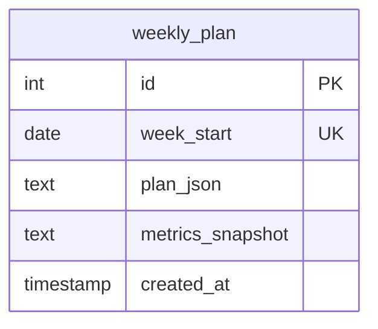

# Weekly Intelligence — Dashboard to Coach

## Overview

Transform Run Intel from a data dashboard into a personal coach. Two features: (1) a **Weekly Scorecard** that tells you at a glance whether you're on track for your goals, and (2) a **Weekly Training Plan** that prescribes your entire week — every run, every lift, every rest day — with specific paces, HR zones, and recovery-aware adjustments.

The goal: open the app once in the morning, know exactly what to do, and trust it.

## Problem Statement

Right now the user has to mentally connect dots across 5 tabs to answer "am I doing well?" The data is all there — Whoop recovery, run history, weight from Withings, nutrition logs, VDOT, CTL/ATL/TSB — but it's presented as individual metrics, not as a coherent story. The daily workout prescription is reactive (one day at a time) and doesn't account for weekly structure — you can't plan quality sessions, long runs, and rest days when the app only knows about today.

The user's weekly training plan (provided below) shows what "useful" looks like:
```
Monday — Chest + Easy Run (3 mi @ 10:00, HR cap 152)
Tuesday — VO2 Max Intervals (4x4 min @ 7:00-7:15, recovery jogs to 133)
Wednesday — Legs + Easy Run (4 mi @ 9:45, HR cap 152)
Thursday — Mid-Week Volume (7 mi easy + 6x20s strides)
Friday — Back + Easy Run (4 mi @ 9:45, HR cap 152)
Saturday — Shakeout (5 mi @ 9:45, HR cap 148)
Sunday — Long Run (12 mi: 9 easy + 3 @ marathon pace 8:45-9:00)
```

This is what the app should generate automatically — grounded in the user's actual fitness data.

## Proposed Solution

### Feature 1: Weekly Scorecard

A single card on the dashboard showing progress toward all three goals with clear on-track/off-track signals.

```
┌─────────────────────────────────────────────────────┐
│  THIS WEEK                                    W/E Mar 15 │
│                                                         │
│  WEIGHT     194.4 → 185 lbs     ↓ 1.6/wk   On track   │
│  MARATHON   ~3:29 → sub-3:00    EF ↑ 14%    Building   │
│  BODY FAT   20.1% → 16%         ↓ trending  On track   │
│                                                         │
│  Budget: 1,890 cal | Protein: 82% compliance            │
│  Zone 2: 26/150 min | Recovery avg: 59%                 │
└─────────────────────────────────────────────────────┘
```

**Data sources (all already computed):**
- Weight: `body_comp` table (Withings sync), `user_profile.goal_weight_lbs`
- Marathon: `MetricsSnapshot.vdot` → `vdot_to_marathon_time()`, `user_profile.goal_marathon_time_min`
- Body fat: `body_comp.body_fat_pct`, `user_profile.goal_body_fat_pct`
- Nutrition: `nutrition_log` aggregated for the week
- Zone 2: `MetricsSnapshot.zone2_minutes_week`
- Recovery: `recovery` table averaged for the week

**On-track logic:**
- Weight: losing 1-2 lbs/week = on track, >2 = too fast, gaining = off track
- Marathon: EF improving or plateau = building, EF declining = stalling
- Body fat: trending down = on track (requires >= 2 data points in 30 days)
- Each goal shows: current value, target, trend direction, status label

### Feature 2: Weekly Training Plan

A 7-day training plan generated from the user's data, shown on the dashboard as "today's workout" with the full week visible.

#### Plan Generation Logic

**Inputs:**
- `MetricsSnapshot` (VDOT, CTL, ATL, TSB, ACWR, EF trend)
- `UserProfile` (goals, max_hr, age)
- Latest recovery score + HRV trend
- Current week's day (Mon-Sun)

**Weekly structure template (based on user's actual training pattern):**

| Day | Type | Description |
|-----|------|-------------|
| Mon | Lift + Easy | Upper body lift + short easy run |
| Tue | Quality #1 | VO2 intervals OR tempo (based on training phase) |
| Wed | Lift + Easy | Legs lift + easy run |
| Thu | Volume | Mid-week longer easy run + strides |
| Fri | Lift + Easy | Back/upper lift + easy run |
| Sat | Pre-long | Easy shakeout OR Quality #2 (if fresh enough) |
| Sun | Long Run | Progressive long run with marathon pace finish |

**Pace targets (from VDOT):**
```python
# Already exists in coaching.py, extend:
easy_pace_sec = max(420, 660 - (vdot - 30) * 6)   # ~9:45 at VDOT 45
tempo_pace_sec = max(350, 540 - (vdot - 30) * 5)   # ~7:00 at VDOT 45
interval_pace_sec = tempo_pace_sec - 45              # ~6:15 at VDOT 45
marathon_pace_sec = easy_pace_sec - 60               # ~8:45 at VDOT 45
```

**HR zones (from max_hr):**
```python
easy_hr_cap = int(max_hr * 0.76)        # 140 for max 184
marathon_hr = int(max_hr * 0.85)        # 156 for max 184
tempo_hr = int(max_hr * 0.88)           # 162 for max 184
interval_hr_low = int(max_hr * 0.93)    # 171 for max 184
interval_hr_high = int(max_hr * 0.98)   # 180 for max 184
recovery_hr = int(max_hr * 0.72)        # 133 for max 184
```

**Weekly mileage target:**
```python
# Based on CTL progression — don't increase more than 10%/week
base_weekly_miles = max(25, ctl * 1.2) if ctl else 30
# Cap at reasonable max
weekly_miles = min(base_weekly_miles, 55)
```

**Distance distribution:**
```python
long_run = round(weekly_miles * 0.25, 1)      # 25% of weekly
quality_day = round(weekly_miles * 0.15, 1)    # 15% each quality day
easy_days = weekly_miles - long_run - quality_day  # remainder split across 3-4 easy days
```

**Recovery-aware adjustments:**
- Recovery < 33% or ACWR > 1.5 → Swap quality session for easy, reduce mileage 20%
- Recovery 33-50% → Keep structure but reduce quality session volume (e.g., 4x4 → 3x4)
- TSB < -25 → Flag "heavy fatigue" and suggest a cutback week (reduce 30%)
- If previous week had quality session, don't schedule another until 48h rest

#### Plan Storage

New `weekly_plan` table:

```sql
CREATE TABLE weekly_plan (
    id SERIAL PRIMARY KEY,
    week_start DATE NOT NULL UNIQUE,  -- Monday of the week
    plan_json TEXT NOT NULL,           -- Full 7-day plan as JSON
    metrics_snapshot TEXT,             -- Metrics at generation time (for context)
    created_at TIMESTAMP DEFAULT NOW(),
    regenerated_at TIMESTAMP
);
```

`plan_json` structure:
```json
{
  "week_start": "2026-03-10",
  "weekly_miles_target": 42,
  "days": [
    {
      "date": "2026-03-10",
      "day_label": "Monday",
      "type": "lift_easy",
      "title": "Chest + Easy Run",
      "time_window": "6:00-7:10am",
      "segments": [
        {"activity": "lift", "muscle_group": "chest", "duration_min": 45},
        {"activity": "run", "distance_miles": 3, "pace": "10:00", "hr_cap": 152}
      ],
      "notes": "Shorter than usual — coming off Sunday's long run.",
      "recovery_adjustment": null
    },
    {
      "date": "2026-03-11",
      "day_label": "Tuesday",
      "type": "quality",
      "title": "VO2 Max Intervals",
      "time_window": "6:00-7:05am",
      "segments": [
        {"activity": "warmup", "distance_miles": 1.5, "pace": "9:45"},
        {"activity": "intervals", "reps": 4, "duration_min": 4, "pace_min": "7:00", "pace_max": "7:15", "recovery_min": 3, "hr_target_low": 171, "hr_target_high": 181, "recovery_hr": 133},
        {"activity": "cooldown", "distance_miles": 1, "pace": "easy"}
      ],
      "notes": "If recovery is yellow, drop to 3x4.",
      "recovery_adjustment": "If recovery < 50%, reduce to 3 reps"
    }
  ]
}
```

#### Plan Lifecycle
1. **Generate**: First time user loads dashboard in a new week (Monday or later, no plan for this week yet)
2. **Store**: Save to `weekly_plan` table
3. **Display**: Show today's workout on dashboard, full week accessible
4. **Adjust**: If recovery drops significantly mid-week, flag adjustments on today's card (but don't regenerate the whole plan — show "recovery adjustment" notes)
5. **Regenerate**: User can manually trigger regeneration (button), or auto-regenerate if no workouts logged yet this week

### Dashboard Redesign

Replace the current "Morning Briefing" card with a new coaching-focused layout:

```
┌─ WEEKLY SCORECARD ──────────────────────────────────┐
│  (Feature 1 — goal progress at a glance)            │
└─────────────────────────────────────────────────────┘

┌─ TODAY'S WORKOUT ───────────────────────────────────┐
│  Tuesday — VO2 Max Intervals                        │
│  6:00-7:05am                                        │
│                                                     │
│  1.5 mi warmup @ 9:45                               │
│  4×4 min @ 7:00-7:15 | HR 171-181                   │
│  3 min jog recovery (HR to 133 before next rep)     │
│  1 mi cooldown                                      │
│                                                     │
│  ⚠️ If recovery < 50%, drop to 3×4                  │
│                                                     │
│  [View Full Week]                                   │
└─────────────────────────────────────────────────────┘

┌─ THIS WEEK ─────────────────────────────────────────┐
│  Mon ✓  Tue ►  Wed ○  Thu ○  Fri ○  Sat ○  Sun ○   │
│  3mi    VO2    Legs   7mi    Back   5mi    12mi     │
│         ▲ today                                     │
│                                                     │
│  Target: 42 miles | Completed: 3 / 42               │
└─────────────────────────────────────────────────────┘
```

The existing morning briefing (recovery status, headline) stays but moves below the coaching cards.

## Technical Approach

### Phase 1: Weekly Scorecard (Backend + Frontend)

**`src/services/coaching.py`** — Add scorecard computation:

```python
@dataclass
class GoalProgress:
    label: str           # "Weight", "Marathon", "Body Fat"
    current: str         # "194.4 lbs"
    target: str          # "185 lbs"
    trend: str           # "↓ 1.6/wk"
    status: str          # "on_track" | "building" | "stalling" | "off_track"
    color: str           # "#00F19F" | "#FFD600" | "#FF4D4D"

@dataclass
class WeeklyScorecard:
    week_ending: str
    goals: list          # list of GoalProgress dicts
    nutrition_compliance: dict  # {calories_pct, protein_pct}
    zone2_minutes: int
    zone2_target: int
    avg_recovery: float | None
    weekly_miles: float
    headline: str        # "Strong week — on track across all goals"
```

- [ ] `compute_weekly_scorecard()` pure function in `coaching.py`
- [ ] Add `GET /api/weekly-scorecard?local_date=YYYY-MM-DD` route
- [ ] Frontend: `WeeklyScorecard` component on dashboard (replaces top position)

### Phase 2: Plan Generation Engine (Backend)

**`src/services/weekly_planner.py`** (new) — Pure function, no DB:

```python
@dataclass
class DayPlan:
    date: str
    day_label: str
    type: str            # "lift_easy" | "quality" | "volume" | "long" | "rest" | "shakeout"
    title: str
    segments: list[dict]
    notes: str
    recovery_adjustment: str | None
    total_miles: float

@dataclass
class WeeklyPlan:
    week_start: str
    weekly_miles_target: float
    days: list[DayPlan]
    generation_context: str   # "Based on VDOT 45, CTL 15.4, recovery avg 62%"
```

- [ ] `generate_weekly_plan(metrics, profile, latest_recovery)` in `weekly_planner.py`
- [ ] Pace targets from VDOT (extend existing formula set)
- [ ] HR zones from max_hr
- [ ] Weekly mileage from CTL (10% progression cap)
- [ ] Distance distribution across days
- [ ] Lift day integration (Mon=chest, Wed=legs, Fri=back)
- [ ] Quality session selection (VO2 intervals when building speed, tempo when building endurance)
- [ ] Recovery-aware volume/intensity adjustments

### Phase 3: Plan Storage + API

**`src/database.py`** — New model:

```python
class WeeklyPlan(Base):
    __tablename__ = "weekly_plan"
    id = Column(Integer, primary_key=True, autoincrement=True)
    week_start = Column(Date, nullable=False, unique=True)
    plan_json = Column(Text, nullable=False)
    metrics_snapshot = Column(Text)
    created_at = Column(DateTime, server_default=sa_func.now())
```

**`src/routes/weekly.py`** (new) — Blueprint:

- [ ] `GET /api/weekly-plan?local_date=YYYY-MM-DD` — Returns current week's plan. Generates if none exists.
- [ ] `POST /api/weekly-plan/regenerate` — Force regenerate this week's plan.
- [ ] Register blueprint in `__init__.py`

### Phase 4: Frontend — Dashboard Coaching Cards

**`src/static/index.html`** — Modify dashboard:

- [ ] `WeeklyScorecardCard` component — 3-column goal progress with status indicators
- [ ] `TodayWorkoutCard` component — Today's prescribed workout from the weekly plan, with segments, paces, HR zones
- [ ] `WeekOverviewStrip` component — Mon-Sun mini timeline showing completed (✓), today (►), and upcoming (○) days with workout types
- [ ] Move existing `MorningBriefing` below the coaching cards
- [ ] "View Full Week" expands to show all 7 days

### Phase 5: Polish

- [ ] Week navigation (view previous/next week)
- [ ] Actual vs planned tracking (when user logs a run on a quality day, show "planned 4x4 VO2 — completed 3mi easy" or "nailed it!")
- [ ] Mid-week recovery alerts on today's card
- [ ] Empty state for first-time users (no history → generic starter plan)

## Database Schema Changes



Migration SQL:
```sql
CREATE TABLE IF NOT EXISTS weekly_plan (
    id SERIAL PRIMARY KEY,
    week_start DATE NOT NULL UNIQUE,
    plan_json TEXT NOT NULL,
    metrics_snapshot TEXT,
    created_at TIMESTAMP DEFAULT NOW()
);
```

## Files to Create/Modify

| File | Action | Description |
|------|--------|-------------|
| `src/services/weekly_planner.py` | CREATE | Plan generation engine (pure functions) |
| `src/services/coaching.py` | MODIFY | Add `WeeklyScorecard`, `GoalProgress`, `compute_weekly_scorecard()` |
| `src/routes/weekly.py` | CREATE | Weekly plan + scorecard API endpoints |
| `src/routes/__init__.py` | MODIFY | Register weekly blueprint |
| `src/database.py` | MODIFY | Add `WeeklyPlan` model + migration |
| `src/static/index.html` | MODIFY | Dashboard coaching cards (scorecard, today's workout, week strip) |

## Acceptance Criteria

### Weekly Scorecard
- [ ] Shows progress for weight, marathon, and body fat goals
- [ ] Each goal has: current, target, trend, on-track/off-track status
- [ ] Includes nutrition compliance (% days hitting calorie + protein targets)
- [ ] Shows Zone 2 minutes vs 150-min target
- [ ] Shows average recovery for the week
- [ ] Headline summarizes the week in one sentence
- [ ] Graceful degradation: goals without data show "Set in Settings"

### Weekly Training Plan
- [ ] Generates 7-day plan with specific workouts for each day
- [ ] Each day includes: type, title, distance, pace range, HR zones
- [ ] Paces derived from VDOT (easy, tempo, interval, marathon)
- [ ] HR zones derived from max_hr
- [ ] Weekly mileage based on CTL (10% cap)
- [ ] Lift days integrated (Mon=chest, Wed=legs, Fri=back)
- [ ] 2 quality sessions + 1 long run + easy days
- [ ] Recovery adjustments: shows conditional notes (e.g., "if recovery < 50%, drop to 3x4")
- [ ] Stored in DB (one plan per week, regeneratable)
- [ ] Plan generates on first dashboard load of the week

### Dashboard
- [ ] Weekly scorecard card at top of dashboard
- [ ] Today's workout card with full detail (segments, paces, HR zones)
- [ ] Week overview strip (Mon-Sun with status indicators)
- [ ] Existing morning briefing moves below coaching cards
- [ ] Works on mobile (responsive)

### Edge Cases
- [ ] No historical data → show generic starter plan with conservative paces
- [ ] Missing goals → scorecard shows "Set in Settings" for that goal
- [ ] No Whoop connection → plan generates without recovery adjustments
- [ ] User misses a workout → don't penalize, next day's plan stays the same
- [ ] Mid-week recovery crash → today's card shows adjustment note
- [ ] Plan already generated for this week → serve from DB, don't regenerate

## Key Design Decisions (from SpecFlow analysis)

### D1: Weekly plan REPLACES the daily workout prescription
The current `prescribe_workout()` in the Morning Briefing and the weekly plan serve the same purpose. The weekly plan supersedes it when a plan exists. `prescribe_workout()` becomes the fallback for users who haven't generated a plan yet (insufficient data).

### D2: On-track/off-track thresholds (concrete)
- **Weight**: On track if losing 0.5-2.0 lbs/week. If `goal_target_date` is set, on track if projected to reach goal within 2 weeks of that date. Too fast if >2 lbs/week. Off track if gaining or flat for 2+ weeks.
- **Marathon/VDOT**: On track if EF trend is "improving" or VDOT increased in last 30 days. Building if EF is "plateau" but Zone 2 compliance is good. Stalling if EF is "declining."
- **Body fat**: On track if latest BF% < BF% from 30+ days ago. Requires at least 2 data points in 60 days; otherwise shows "Need more data."

### D3: Week = Monday-Sunday, using client's local date
Same `local_date` pattern as the briefing fix. Client sends `?local_date=YYYY-MM-DD`, backend computes the Monday of that week.

### D4: Lazy plan generation (no scheduler)
Plan generates on first dashboard load of the week. No background jobs. To prevent race conditions on concurrent loads, use `INSERT ... ON CONFLICT (week_start) DO NOTHING` — first request wins.

### D5: Mid-week recovery adjustments are OVERLAY, not mutation
The stored plan is the "ideal week." On each dashboard load, today's workout checks real-time recovery. If recovery is low, display the adjustment note (already in the plan's `recovery_adjustment` field) as a prominent warning. The DB plan is never mutated — it stays as the original prescription.

### D6: Lift schedule is a default template, configurable later
Default: Mon=chest, Wed=legs, Fri=back. Stored as concept in the plan generator, not in the DB. Future: add `preferred_schedule` JSON to `UserProfile`.

### D7: Expand VDOT pace table to 5 types
Add to coaching.py:
```python
def vdot_paces(vdot):
    """Return dict of pace targets (seconds/mile) for all workout types."""
    easy = max(420, 660 - (vdot - 30) * 6)        # ~9:45 at VDOT 45
    marathon = max(380, 600 - (vdot - 30) * 5.5)   # ~8:45 at VDOT 45
    tempo = max(350, 540 - (vdot - 30) * 5)         # ~7:00 at VDOT 45
    interval = max(310, 490 - (vdot - 30) * 4.5)    # ~6:15 at VDOT 45
    repetition = max(280, 450 - (vdot - 30) * 4)    # ~5:45 at VDOT 45
    return {"easy": easy, "marathon": marathon, "tempo": tempo, "interval": interval, "repetition": repetition}
```

### D8: HR zone function
Add to coaching.py:
```python
def compute_hr_zones(max_hr):
    """Return HR zones as dict."""
    return {
        "recovery": int(max_hr * 0.65),      # <65% — recovery jogs
        "easy_cap": int(max_hr * 0.76),       # 76% — easy run ceiling
        "marathon_low": int(max_hr * 0.80),   # 80-85% — marathon pace
        "marathon_high": int(max_hr * 0.85),
        "tempo": int(max_hr * 0.88),          # 88% — threshold
        "interval_low": int(max_hr * 0.93),   # 93-98% — VO2max
        "interval_high": int(max_hr * 0.98),
    }
```

### D9: Minimum data for plan generation
- **Required**: At least 7 days of run data + a computed VDOT (1 run >= 3mi with HR)
- **Required**: `max_hr` in profile (or age for estimation)
- **Recommended**: 2+ weeks of recovery data from Whoop
- **Fallback**: If insufficient data, show "Log 7+ runs to unlock your weekly plan" with a progress indicator (X/7 runs logged)

### D10: Logged runs match planned workouts by date
Simple date match — first run logged on a given date pairs with that day's plan. No explicit linking needed. Shown as "Planned: 4mi easy @ 9:45 | Actual: 4.2mi @ 9:32" on the week strip.

## Recommended Build Order

1. **Scorecard backend** — `compute_weekly_scorecard()` in coaching.py + route
2. **Scorecard frontend** — `WeeklyScorecardCard` on dashboard
3. **Plan engine** — `generate_weekly_plan()` in weekly_planner.py (with expanded VDOT paces + HR zones)
4. **Plan storage + API** — DB model, route, lifecycle (with ON CONFLICT guard)
5. **Today's workout card** — Frontend component (with recovery overlay logic)
6. **Week overview strip** — Frontend component (with actual vs planned)
7. **Dashboard layout** — Reorganize: scorecard → today's workout → week strip → existing briefing
8. **Polish** — Empty states, mobile, missed workout handling
